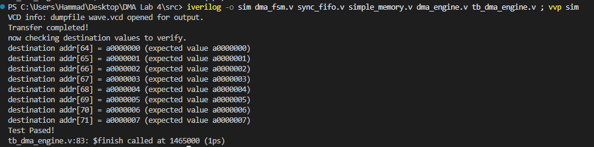
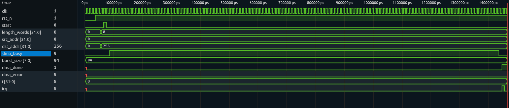

# DMA Engine Design — RTL Lab


| | |
|---|---|
| **Topic** | DMA Engine Design |
| **Scope** | RTL design of a simple AXI-style DMA engine performing memory-to-memory transfers |

A Direct Memory Access (DMA) engine moves data between memory locations without the
CPU copying every word itself. Instead of the CPU issuing a read + write for every word
in a block (wasting CPU cycles), the CPU simply configures the DMA with a source address,
destination address, and transfer length, and the DMA controller performs the transfer
independently — freeing the CPU to keep executing other code.

This repo implements the three parts of the lab:

- **Task 1 — DMA FSM (`dma_fsm.v`)**
  The core finite-state machine controlling the transfer sequence:
  `IDLE → READ → WAIT_READ → WRITE → WAIT_WRITE → INC_ADDR → (loop or DONE)`.
  Implements the state transition table, output control signal table, and register
  update summary given in the lab handout.

- **Task 2 — Synchronous FIFO (`sync_fifo.v`)**
  A configurable-depth, configurable-width, single-clock-domain FIFO used as the
  staging buffer between the DMA's read and write phases. Implemented as a
  first-word-fall-through FIFO (read data is valid combinationally as soon as
  `rd_en` is asserted).

- **Task 3 — Complete DMA Engine (`dma_engine.v` + `simple_memory.v`)**
  Integrates the FSM and FIFO with a memory model to perform an actual
  memory-to-memory transfer, and adds:
  - Source/destination address and length configuration registers
  - Status outputs: `dma_busy`, `dma_done`, `dma_error`
  - Interrupt pulse (`irq`) on transfer completion
  - Basic error handling (out-of-range memory access aborts the transfer and
    asserts `dma_error`)
  - A `burst_size` input with a word counter for burst pacing between bursts
    (see **Known Limitations** below)

## Repository Structure

```
.
├── src/            # All Verilog design + testbench source files
├── images/         # Simulation waveform and console output screenshots
└── doc/            # Original lab handout (PDF)
```

## Source Files

| File | Description |
|---|---|
| `src/dma_fsm.v` | Task 1 — DMA FSM controller |
| `src/sync_fifo.v` | Task 2 — synchronous staging FIFO |
| `src/simple_memory.v` | Behavioral memory model with configurable access latency and address-range checking, used as the shared memory the DMA reads/writes |
| `src/dma_engine.v` | Task 3 — top-level engine integrating the FSM, FIFO, and memory, with burst/status/interrupt logic |
| `src/tb_dma_engine.v` | Testbench: pre-loads known data, triggers an 8-word transfer, and checks the destination memory against expected values |

## How to Build and Run

Using [Icarus Verilog](http://iverilog.icarus.com/):

```bash
cd src
iverilog -o sim dma_fsm.v sync_fifo.v simple_memory.v dma_engine.v tb_dma_engine.v
vvp sim
```

This produces a `tb_dma_engine.vcd` waveform file (viewable in GTKWave or any VCD
viewer) and prints a pass/fail summary comparing destination memory contents against
the expected source data.

## Simulation Results

### Console Output

The testbench transfers 8 words from `0x00000000` to `0x00000100` and verifies each
destination word against the known source data:



```
---- Transfer complete ----
dst[0] = a0000000  (expected a0000000)
dst[1] = a0000001  (expected a0000001)
dst[2] = a0000002  (expected a0000002)
dst[3] = a0000003  (expected a0000003)
dst[4] = a0000004  (expected a0000004)
dst[5] = a0000005  (expected a0000005)
dst[6] = a0000006  (expected a0000006)
dst[7] = a0000007  (expected a0000007)
No errors reported.
```

All 8 words match, and `dma_error` remains deasserted throughout.

### Waveform

`dma_busy` rises shortly after `start` and stays high for the full transfer;
`dma_done` and `irq` pulse together once the last word has been written back to memory:




