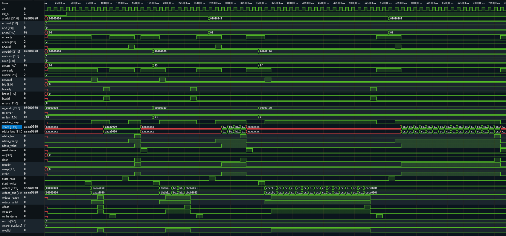
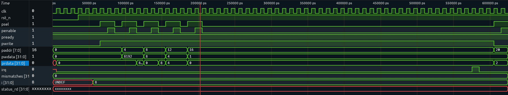
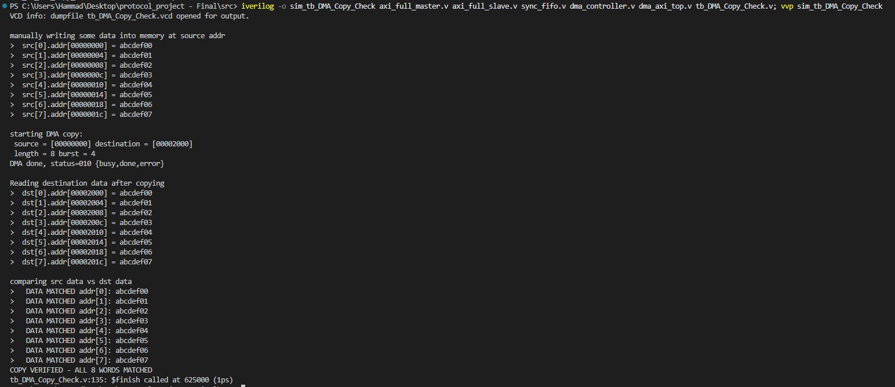

# AXI DMA Protocol Project

This is a small AXI4 (full, burst-capable) master/slave pair I built from scratch, plus a DMA controller on top of it that moves data between two memory regions in bursts. Everything's in Verilog, verified with Icarus Verilog.

I split it into two phases: first get a working AXI4 master and slave that can do INCR bursts (1-16 beats), verify those against each other directly. Then build a DMA engine that drives the master through a register interface (basically APB-lite) and chunks a transfer into back-to-back bursts.

## Architecture

```
                  ┌────────────────────────┐
   APB-lite  ---> │    dma_controller      │
  (SRC/DST/LEN/   │  (chunking FSM +       │
   BURST/CTRL/    │   sync_fifo staging)   │
   STATUS regs)   └───────────┬────────────┘
                              │ AXI (master)
                  ┌───────────▼────────────┐
                  │    axi_full_master     │
                  └──────────┬─────────────┘
                             │ AXI channels
                  ┌──────────▼─────────────┐
                  │     axi_full_slave     │
                  │  (memory-mapped mem[]) │
                  └────────────────────────┘
```

`dma_axi_top` instantiates `dma_controller` + `axi_full_slave` and connects
them point to point (no interconnect, there's exactly one master and one
slave in this system).

### Modules (`src/`)

| File | Description |
|---|---|
| `axi_full_master.v`  `axi_full_slave.v` | The AXI4 layer. INCR bursts up to 16 beats, fixed 32-bit data width, single AXI ID (so ordering is never an issue). `tb_axi_full.v` tests these two against each other directly at burst lengths 1, 4, and 16. |
| `dma_controller.v` | the register-programmable DMA. Register map is below. Breaks a transfer into `BURST_SIZE`-beat chunks and does read-burst -> write-burst -> repeat until done, raising `irq` at the end. |
| `sync_fifo.v` | Used to stage data between the DMA's read burst and write burst. |
| `dma_axi_top.v` | Top-level, DMA + slave wired together. |
| `tb_axi_full.v` | Phase 1 testbench: drives `axi_full_master` directly through burst lengths 1, 4, and 16 and checks read/write data against expected patterns. |
| `tb_dma_axi_top.v` | Phase 2 system testbench: programs the DMA over APB-lite, waits for `irq`/`STATUS.DONE`, and checks destination memory against the source pattern. Runs an evenly-divisible transfer and one with a partial final burst. |

### DMA register map

Word-addressed, `PADDR[7:2]` selects the register:

| Offset | Name | Access | Description |
|---|---|---|---|
| `0x00` | `SRC_ADDR` | R/W | Source starting address |
| `0x04` | `DST_ADDR` | R/W | Destination starting address |
| `0x08` | `LENGTH` | R/W | Total transfer length, in 32-bit words |
| `0x0C` | `BURST_SIZE` | R/W | Beats per AXI burst (1–16) |
| `0x10` | `CONTROL` | R/W | bit0 = `START` (self-clearing pulse on write) |
| `0x14` | `STATUS` | R | bit0 = `BUSY`, bit1 = `DONE`, bit2 = `ERROR` |

> **Note:** `BURST_SIZE` here is the number of AXI beats per burst (1–16), not
> a per-beat transfer width, the data path is a fixed 32-bit (4-byte) word
> throughout. True sub-word (8/16-bit) transfers via `WSTRB`/`AxSIZE` are a
> straightforward follow-on left out of this version to keep it verifiable.

## Building and running the tests

Requires [Icarus Verilog](https://github.com/steveicarus/iverilog.git).

**Phase 1: AXI master/slave protocol test:**
```bash
iverilog -o sim_axi_full axi_full_master.v axi_full_slave.v tb_axi_full.v; vvp sim_axi_full
```

**Phase 2: full DMA test:**
```bash
iverilog -o sim_dma_axi axi_full_master.v axi_full_slave.v sync_fifo.v dma_controller.v dma_axi_top.v tb_dma_axi_top.v; vvp sim_dma_axi
```

Both testbenches dump a `.vcd` waveform (`tb_axi_full.vcd`, `tb_dma_axi_top.vcd`)
that can be viewed with [GTKWave](http://gtkwave.sourceforge.net/) or similar.

## Test results

**Phase 1** - burst lengths 1, 4, 16 all matched beat-for-beat:



**Phase 2** - 16 word transfer (4 whole bursts of 4) and a 10 word transfer
(2 whole bursts + 1 partial burst of 2) both complete with `STATUS.DONE=1`,
`STATUS.ERROR=0`, and destination memory matching the source pattern:



```
Transfer 1: 16 words, burst=4 (4 whole bursts)
Transfer src = [00000000] to dst = [00001000] len = 16 burst = 4 -> status = 010 {busy,done,error}

Transfer 2: 10 words, burst=4 (2 whole + 1 partial burst of 2)
Transfer src = [00002000] to dst = [00003000] len = 10 burst = 4 -> status = 010 {busy,done,error}

ALL TESTS PASSED
```

I also wanted to actually *see* the copy happen rather than just trust the
status register, so `tb_DMA_Copy_Check.v` writes a known pattern into the
source region, runs the DMA, and prints both sides plus compare them word by word:




## Repository layout

```
.
├── src/
│   ├── axi_full_master.v
│   ├── axi_full_slave.v
│   ├── dma_controller.v
│   ├── dma_axi_top.v
│   ├── sync_fifo.v
│   ├── tb_axi_full.v
│   └── tb_dma_axi_top.v
|   └── tb_DMA_Copy_Check.v
└── images/
    ├── tb_dma_copy_wave.png
    ├── tb_dma_copy_check.png
    ├── tb_axi_full.png
    └── tb_dma_axi_top.png
```

## Known simplifications

- Single fixed AXI ID per master/slave - trivially in order, no ID based reordering.
- `AWSIZE`/`ARSIZE` fixed at 4 bytes (32-bit data width throughout).
- `AWBURST`/`ARBURST` fixed at INCR - the only burst type required by the project spec.
- `WSTRB` passed through from the producer rather than generated internally.
- One outstanding transaction (read or write) at a time on both the master
  and slave - no interconnect/arbitration is needed since there's exactly
  one master and one slave.
